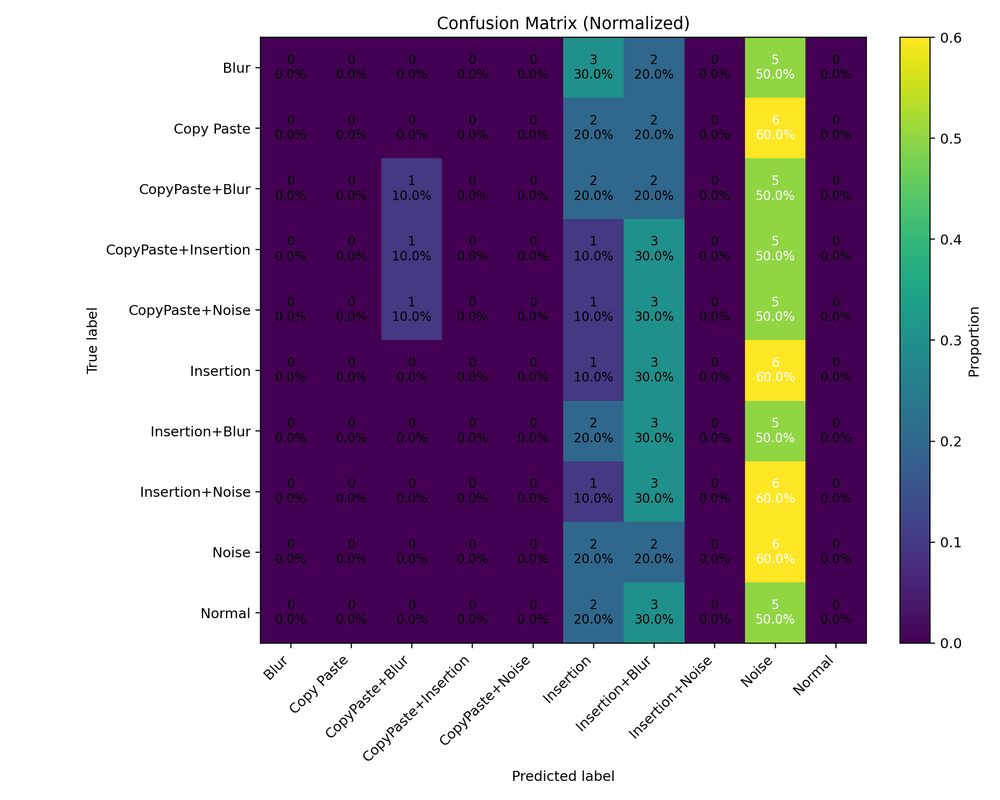

# 🔍 DocuVerify — AI for Fake Document & Handwritten Forgery Detection

DocuVerify is a deep-learning pipeline that classifies **handwritten document forgeries / manipulations** (e.g., *Normal, Blur, Noise, CopyPaste+Noise, Insertion+Blur*, …) and provides evaluation & visualization utilities.

Built for Windows paths and your dataset layout under:

C:\Users\sagni\Downloads\Docu Verify\

yaml
Copy code

---

## 📂 Dataset Layout (used in training)

Using the **Forged Handwritten Document Database (2023)** with class folders:

C:\Users\sagni\Downloads\Docu Verify
└─ Forged Handwritten Document Database
└─ Forged Handwritten Document Database
└─ Handwritten Forged Document Dataset 2023
├─ Normal
├─ Insertion+Blur
├─ Insertion+Noise
├─ Noise
├─ CopyPaste+Insertion
├─ CopyPaste+Noise
├─ Insertion
├─ Copy Paste
├─ CopyPaste+Blur
└─ Blur

yaml
Copy code

> The **parent folder** `Handwritten Forged Document Dataset 2023` is treated as `DATA_ROOT`. Each subfolder is a **class**.

---

## ⚙️ Requirements

Install once (Python 3.10+ recommended):

```bash
pip install "tensorflow==2.15.0" tensorflow-io-gcs-filesystem==0.34.0
pip install numpy pandas scikit-learn pillow pyyaml tqdm matplotlib
🚀 Train the Classifier + Save Artifacts & Plots
Script: train_docuverify_with_plots.py
What it does:

Trains EfficientNetB0 (transfer learning) on your dataset

Saves artifacts to C:\Users\sagni\Downloads\Docu Verify\:

model.h5 — trained model

class_indices.pkl — label→index map

metrics.json — training curves

val_predictions.json — validation predictions

run_config.yaml — full run config

Plots:

accuracy_loss.png, accuracy_loss_acc.png, accuracy_loss_loss.png

confusion_matrix.png

CSVs: classification_report.csv, confusion_matrix.csv

Run:

bash
Copy code
python train_docuverify_with_plots.py
Outputs directory:

makefile
Copy code
C:\Users\sagni\Downloads\Docu Verify\
📈 View Results (Accuracy Graph + Heatmap)
Script: view_docuverify_results.py
Reads your saved artifacts and shows plots (also saves view copies):

accuracy_loss_view.png

confusion_matrix_view.png

classification_report_view.csv

confusion_matrix_view.csv

Run from CMD:

bash
Copy code
python view_docuverify_results.py
Run inside Jupyter:

python
Copy code
%run view_docuverify_results.py
🔮 Inference: Predict on Any Image/Folder
Script: predict_docuverify.py

Input: single image or a folder (recursively scanned)

Output in C:\Users\sagni\Downloads\Docu Verify\:

predictions.json

predictions.csv

annotated_predictions\*_pred.png (optional)

Examples:

bash
Copy code
# Single file
python predict_docuverify.py "C:\Users\sagni\Downloads\Docu Verify\Forged Handwritten Document Database\...\sample.jpg"

# Full folder
python predict_docuverify.py "C:\Users\sagni\Downloads\Docu Verify\Forged Handwritten Document Database\...\SomeSet" 
🧪 Demo Evaluation: “Right Prediction” vs Ground-Truth
Script: predict_demo_with_truth.py

Scans all images under:

mathematica
Copy code
C:\Users\sagni\Downloads\Docu Verify\Forged Handwritten Document Database\Forged Handwritten Document Database\Handwritten Forged Document Dataset 2023\Demo
Ground truth is inferred from the parent folder name of each image (so organize Demo like Demo\<TrueClass>\image.png).

Saves to C:\Users\sagni\Downloads\Docu Verify\:

demo_predictions.csv + demo_predictions.json

demo_summary.json — overall accuracy, per-class accuracy, predicted counts

annotated_demo\*_pred.png — shows pred, confidence, GT, and ✓/✗

mistakes_demo\... — copies misclassified images for quick review

Run:

bash
Copy code
python predict_demo_with_truth.py
CSV columns include:

file, true_label, pred_class, confidence, correct, and top1/2/3_class/_p

📁 Files in This Project
train_docuverify_with_plots.py — Train + save artifacts and plots

view_docuverify_results.py — Render accuracy/loss + confusion matrix from saved artifacts

predict_docuverify.py — Predict (single image / folder) + save JSON/CSV (+ annotate)

predict_demo_with_truth.py — Evaluate Demo with inferred ground truth (+ mistakes folder)

🔧 Configuration Highlights
Image size: 256×256

Backbone: EfficientNetB0 frozen initially (fine-tuning easy to enable)

Batch size: 16 (adjust per GPU/CPU RAM)

Val split: 0.2 via Keras flow_from_directory(validation_split=...)

Augmentations: light rotations, zoom, shifts, brightness — helps generalize scans/photos

To fine-tune: unfreeze the last N layers and train with a smaller LR (e.g., 1e-4) after initial convergence.

🧭 Tips & Troubleshooting
FileNotFoundError: Double-check Windows paths (spaces matter).
Use raw strings r"C:\Users\..." in Python.

No images found: Ensure supported extensions (.jpg,.jpeg,.png,.bmp,.tif,.tiff,.webp) exist.

Class mismatch: Training locks class order using folder names. If you add/remove classes, retrain.

Low accuracy?

Increase epochs (e.g., 25–30)

Enable short fine-tuning of the backbone

Balance classes / add more samples

Use higher resolution (320×320) if VRAM allows

🧱 Roadmap (Optional Enhancements)
Explainability: Grad-CAM overlays for highlighted suspicious regions.

Text & Layout checks: OCR (EasyOCR/Tesseract) + regex/NLP rules for ID numbers, dates.

Deployment: Streamlit app (upload → prediction → highlighted output/report).

Export: ONNX/TFLite for faster CPU/edge inference.
Author
SAGNIK PATRA
